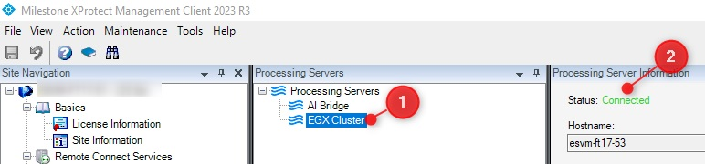

## Connectivity sample - IVA app

The Connectivity sample app is a Golang-based IVA (Intelligent Video Analytics) application that showcases Milestone AI Bridge features.

When installed and configured, the IVA app can:

- Render snapshots from cameras connected to the XProtect VMS
- Send analytic events to the XProtect VMS

Content:

- [Sample IVA App features & code](#sample-iva-app-features--code)
- [How to build](#how-to-build)
  - [Build executable](#build-executable)
  - [Build Docker image](#build-docker-image)
- [How to install](#how-to-install)
  - [Requirements](#requirements)
  - [Run as process](#run-as-process)
  - [Install the app based on Docker Compose](#install-the-app-based-on-docker-compose)
  - [Install the app based on helm chart](#install-the-app-based-on-helm-chart)
- [How to uninstall](#how-to-uninstall)
- [Confirm the installation was successful](#confirm-the-installation-was-successful)

### Sample IVA App features & code

To learn about the sample features and code structure, find the documentation at the [src](src/README.md) directory.

### How to build

#### Build executable

To build the binary using the Go compiler for the amd64 architecture, run the following command:

```bash
chmod +x build-binary.sh
./build-binary.sh
```

To build for the arm64 architecture, run the following command:

```bash
chmod +x build-binary.sh
ARCH=arm64 ./build-binary.sh
```

#### Build Docker image

To build the Docker image for amd64 architecture, run the following command:

```bash
chmod +x build-image.sh
./build-image.sh
```

To build the image for arm64 architecture, run the following command:

```bash
# Replace amd64 with arm64 in the script build-image.sh
sed -i 's/amd64/arm64/g' build-image.sh
chmod +x build-image.sh
./build-image.sh
```

### How to install

The sample IVA app contains `Docker Compose` and `helm chart` configuration files to assist the deployment of the connectivity sample IVA app. It is also possible to run the IVA app as a process for debug purposes.

The relevant deployment files are as follows:

```txt
.
...
├── .env
├── certs
│   ...
│   ├── tls-ca
│   │   └── vms-authority.crt
│   └── tls-server
│       ...
│       ├── server.crt
│       └── server.key
├── config
    └── register.graphql
```

Main files:

- .env: This file contains the IVA app's settings. You must change the `EXTERNAL_IP` and `EXTERNAL_HOSTNAME` variables and possibly change more than these variables, depending on your network and machines.
- certs: The certificate files in this folder must be identical to the files used by [Securing the Milestone AI Bridge connection (Docker Compose)](https://doc.milestonesys.com/AIB/Help/latest/en-us/feature_flags/ff_aibridge/aibi_dc_securing.htm). For helm chart installation, use the same certificates used for [Securing the Milestone AI Bridge connection (Kubernetes)](https://doc.milestonesys.com/AIB/Help/latest/en-us/feature_flags/ff_aibridge/aibi_k8_securing_aib_connection.htm). The usage of certificates are OPTIONAL and only relevant if the IVA app runs over SSL.
- config: This folder contains the `register.graphql` file where IVA topics can be defined for the IVA app.

The rest of files located at this directory will be explained at the relevant deployment methods.

#### Requirements

- The sample IVA app can run unsecured (http) or fully secured (https) and therefore must include TLS certificates. The IVA app uses the same TLS certificates as you used when you deployed and configured your Milestone AI Bridge. You can copy the TLS certificates to the certs folder in PEM format (with .crt extension). For more information, see the readme tile in the [certs](certs/README.MD) folder.

- Ensure Milestone AI Bridge is installed correctly and running. Moreover, the `connected` label should be displayed on the Processing server node in `XProtect Management Client`. **For local runs: Make sure to run Milestone AI Bridge with debug mode activated - To learn more about Milestone AI Bridge debug mode, refer to the following documentation [Deploying Milestone AI Bridge (Docker Compose)](https://doc.milestonesys.com/AIB/Help/latest/en-us/feature_flags/ff_aibridge/aibi_dc_deploy_aib.htm).**

<br>

<br>

- Open the [.env](./.env) file and set up the network configuration for the app:

  - The EXTERNAL_IP and EXTERNAL_HOSTNAME variables must point to the machine where the IVA app is located. This is required for systems that are not in the network domain. **For local and Compose runs: Make sure to run the IVA app on the same machine where Milestone AI Bridge containers are running.**

  ```bash
  EXTERNAL_IP="116.234.169.95"
  EXTERNAL_HOSTNAME="my-hostname"
  ```

  - If your VMS is running on a machine that is not in the network domain, you must additionally define `VMS_IP` and `VMS_HOSTNAME` variables in the following section in the [.env](.env) file. **For local runs: Make sure to add the extra host to your system hosts file**

  ```bash
  # Define these variables if your vms is not in the network domain
  # VMS_IP="<my-management-server-ip>"
  # VMS_HOSTNAME="<my-management-server-hostname>"
  ```

  Check the `docker-compose.yml` to remove the comment marks for the relevant configuration.

  ### Change default protocol (https/http)
  - You can specify which protocol (https or http) your IVA app uses. This enables you to switch between the relatively secure protocol (https) for daily operations and the standard mode (http) for specific scenario testing or debugging purposes. The default setting of the IVA app after installation is http. To change the default settings

  - Set the `TLS_ENABLED` and `TLS_SCHEME` variables in the [.env](.env) file:

  ```bash
    # Encrypt communication with XProtect using TLS
    # When set to true the app will be exposed through https. Otherwise, set to false.
    TLS_ENABLED=true
    # If the IVA app is configured with certificates use https, otherwise use http.
    TLS_SCHEME="https"
  ```

Once you fulfilled the requirements, run the IVA app and do following:

- [Run as process](#run-as-process)
- [Install the app based on Docker Compose](#install-the-app-based-on-docker-compose) (if you are using Docker-Compose)
- [Install the app based on helm chart](#install-the-app-based-on-helm-chart) (if you are using Kubernetes)

#### Run as process

In addition to the files explained in the [How to install](#how-to-install) section, you can use the `run-binary.sh` script to assist you in running the IVA app binary by providing the necessary input parameters to connect it with Milestone AI Bridge successfully. Before using the script, make sure to build the binary by following the [How to build](#how-to-build) section.

When the Milestone AI Bridge is running in debug mode and the required network configuration has been set up, so your apps are trusted, you must resolve both names for the VMS and the machine hosting Milestone AI Bridge. The machine hosting Milestone AI Bridge must be the same host on which the sample app runs.

**NOTE:**

Since the IVA app will be running on the same machine as the Milestone AI Bridge (based on the publicly available Docker Compose configuration), there are some parameters that will already be available for all IVA apps:

- The server-tls folder must contain the two files [`server-tls/server.crt`](./certs/tls-server/server.crt) and [`server-tls/server.key`](./certs/tls-server/server.key). Both are mandatory, if you are running the IVA app in secured mode (https).

For more information, see: [Securing the Milestone AI Bridge connection (Docker Compose)](https://doc.milestonesys.com/AIB/Help/latest/en-us/feature_flags/ff_aibridge/aibi_dc_securing.htm).

Do the following to run the sample IVA app on your system:

- Run the binary by executing the following script:

  ```bash
  chmod +x run-binary.sh
  ./run-binary.sh
  ```

  Expected output:

  ```txt
  2024/11/22 18:00:51 Component: connectivity-sample
  2024/11/22 18:00:51 GoVersion: go1.22.5
  2024/11/22 18:00:51 -aib-webservice-location localhost:4000
  2024/11/22 18:00:51 -app-registration-file-path /path/to/config/register.graphql
  2024/11/22 18:00:51 -app-url-path connectivitysample
  2024/11/22 18:00:51 -app-webserver-port 7443
  2024/11/22 18:00:51 -enforce-oauth true
  2024/11/22 18:00:51 -snapshot-max-height 600
  2024/11/22 18:00:51 -snapshot-max-width 600
  2024/11/22 18:00:51 -tls-certificate-file /path/to/certs/tls-server/server.crt
  2024/11/22 18:00:51 -tls-key-file /path/to/certs/tls-server/server.key
  2024/11/22 18:00:51 Registering the application against all connected VMSs
  2024/11/22 18:00:51 Registration succeeded
  ```

- Check the [Confirm the installation was successful](#confirm-the-installation-was-successful) section to validate your IVA app was run successfully.

#### Install the app based on Docker Compose

In addition to the files explained in the [How to install](#how-to-install) section, you will need the `docker-compose.yml` file, which contains the configuration required to deploy the IVA app using Docker Compose.

**NOTE:**

Since the IVA app will be running on the same machine where Milestone AI Bridge is running (based on the publicly available Docker Compose configuration), there are some parameters that will already be available for all IVA apps:

- (Mandatory, if you are running the IVA app in secured mode) - The `server-tls` folder must contain the two files namely [`server-tls/server.crt`](./certs/tls-server/server.crt) and [`server-tls/server.key`](./certs/tls-server/server.key).

For more information: [Securing the Milestone AI Bridge connection (Docker Compose)](https://doc.milestonesys.com/AIB/Help/latest/en-us/feature_flags/ff_aibridge/aibi_dc_securing.htm).

- Run the docker image by executing the following command:

  ```bash
  docker compose up -d
  ```

  Expected output:

  ```txt
  [+] Running 1/1
  ✔ Container runtime-connectivity-sample-1  Started   
  ```

  Running the docker logs command to confirm the app registered it self successfully:

  ```txt
  Updating certificates in /etc/ssl/certs...
  rehash: warning: skipping ca-certificates.crt,it does not contain exactly one certificate or CRL
  1 added, 0 removed; done.
  Running hooks in /etc/ca-certificates/update.d...
  done.
  2024/11/25 09:59:18 Component: connectivity-sample
  2024/11/25 09:59:18 GoVersion: go1.22.9
  2024/11/25 09:59:18 -aib-webservice-location aibridge-webservice:4000
  2024/11/25 09:59:18 -app-registration-file-path /root/bin/config/register.graphql
  2024/11/25 09:59:18 -app-url-path connectivitysample
  2024/11/25 09:59:18 -app-webserver-port 7443
  2024/11/25 09:59:18 -enforce-oauth true
  2024/11/25 09:59:18 -snapshot-max-height 600
  2024/11/25 09:59:18 -snapshot-max-width 600
  2024/11/25 09:59:18 -tls-certificate-file certs/tls-server/server.crt
  2024/11/25 09:59:18 -tls-key-file certs/tls-server/server.key
  2024/11/25 09:59:18 Registering the application against all connected VMSs
  2024/11/25 09:59:19 Registration succeeded
  ```

- Check the [Confirm the installation was successful](#confirm-the-installation-was-successful) section to validate your app was run successfully.

#### Install the app based on helm chart

If you are using Kubernetes and helm chart to configure your Milestone AI Bridge, you must also use helm chart to configure your IVA apps.

When you have all the requirements listed at the [How to install](#how-to-install) section, you can deploy the sample IVA app on your cluster by following the guide located in the `helm` folder [README](helm/README.md).

When you are finished, check the [Confirm the installation was successful](#confirm-the-installation-was-successful) section to validate your app was run successfully.

### How to uninstall

#### For Docker Compose installation

Navigate to the folder where the IVA app `docker-compose.yaml` file is located and run the following command:

```bash
docker-compose down
```

#### For helm chart installation

Navigate to the folder where the IVA app `values.yaml` file is located and run the following command:

```bash
helm uninstall connectivitysample -n aibridge
```

### Confirm the installation was successful

To confirm the app was registered successfully, check using GraphQL UI client by accessing `http://<EXTERNAL_HOSTNAME>:4001/api/bridge/graphql`

Run the following query:

```GraphQL
query apps {
  about {
    videoManagementSystems {
      id
      apps {
        id
        name
      }
    }
  }
  eventTopics {
    appID
    topicName
  }
}
```

This query should print the following the output to the screen:

```json
{
  "data": {
    "about": {
      "videoManagementSystems": [
        {
          "id": "7cebedaa-9309-4bdf-9851-3f561cce2c07",
          "apps": [
            {
              "id": "28a6bc9a-0833-46c6-958e-19da4ee6d9e5",
              "name": "Connectivity sample"
            }
          ]
        }
      ]
    },
    "eventTopics": [
      {
        "appID": "28a6bc9a-0833-46c6-958e-19da4ee6d9e5",
        "topicName": "getsnapshot"
      },
      {
        "appID": "28a6bc9a-0833-46c6-958e-19da4ee6d9e5",
        "topicName": "sendanalyticevents"
      }
    ]
  }
}
```

### Using

- golang 1.22.5

### Environment

- go, docker, kubernetes

### go package

- [connectivity sample go package]('https://github.com/milestonesys/MIP-AIBridge-samples')

#### Note
- Connectivity sample IVA app is not compliant with the `US Executive Order 14028`