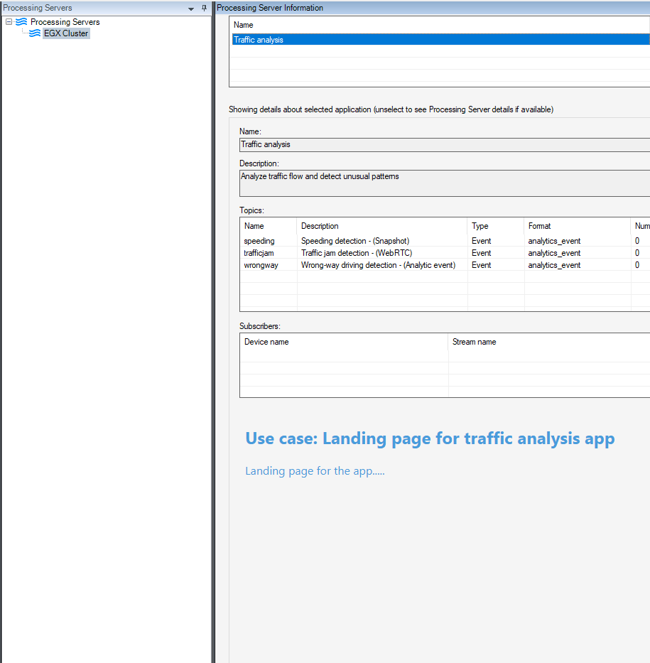
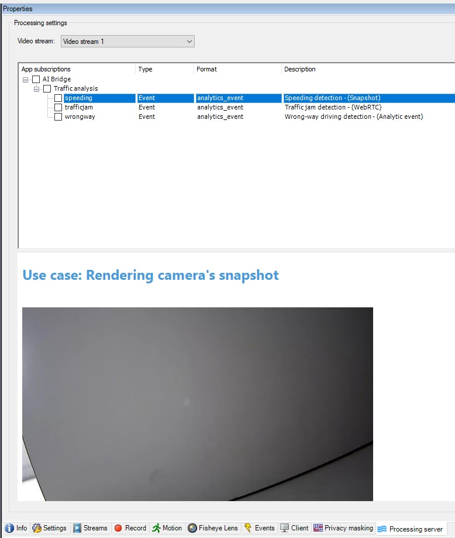
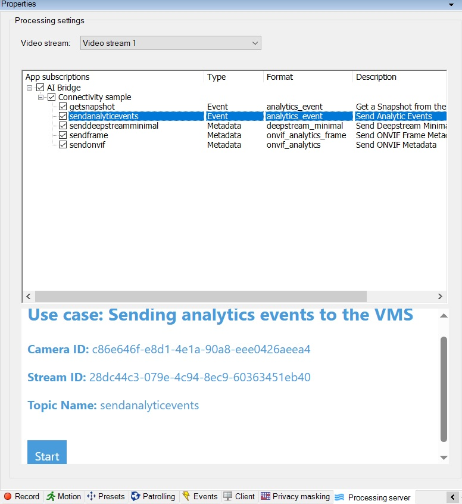

# Sample IVA App

## IVA App code structure

The sample app code design is based on the principles of Domain Driven Design (DDD). The application is composed of various layers of packages.
We have defined we defined 3 layers in this application:

- Application layer: At the application layer, you will find the handlers this application exposes as part of its API as well as Services providing a facade to the whole backend.
  - Handlers: The app has the following handlers:
    - "/": Exposing a static welcome page for the application. For more information, see [Welcome HomePage](#welcome-homepage).
    - "/snapshot/": Showcasing the feature for capturing snapshots. For more information, see [Render snapshots from cameras connected to the XProtect VMS](#render-snapshots-from-cameras-connected-to-the-xprotect-vms).
    - "/event/": Showcasing the feature for sending events. For more information, see [Send analytic events to the XProtect VMS](#send-analytic-events-to-the-xprotect-vms).

  - Services: The app contains the following services:
    - AnalyticEventService: Responsible for starting and stopping the sending of Analytic events.
    - GraphQLService: Exposes an interface for the Milestone AI Bridge Webservice GraphQL API. For more information, open `<AI Bridge External Hostname>:4000`
    - QueryStringService: Responsible for extracting certain values from the handler request url.
    - TokenService: Some of the resources exposed by Milestone AI Bridge require a token for authorization. Usually the `XProtect Management Client` user forwards a token to the application. The application takes the responsibility for verifying and forwarding the token to AI Bridge when requesting the protected resource.

- Domain layer:
  - Token:
    - TokenClaims: A list of IDP registered issuers.
    - TokenValidator: Parses the token issuer and validates it against the TokenClaims.

  - Ticket and TicketManager:
    - For every websocket request, a ticket is required to store the session data.

- Infrastructure layer:
  - GraphQL Repository: A client configured to send GraphQL `queries` and `mutations` based on the Milestone AI Bridge WebService GraphQL API scheme.

## IVA App Features

The Connectivity Sample IVA app contains the following features:

### Welcome HomePage

Accessible from the `Processing Server` node in `XProtect Management Client`.
This feature can provide:

- A description about the app.
- A configuration page for the app if needed.

 

 

### Render snapshots from cameras connected to the XProtect VMS

Can be seen on a camera's topic subscription.

A potential use case could be defining location spots based on a live snapshot within the camera.

To view this functionality, navigate to the `Processing Server` in `XProtect Management Client`, select any camera, and then click on the `getsnapshot` topic. A live snapshot will be rendered by the IVA app.

 

 

### Send analytic events to the XProtect VMS

Can be seen on a camera's topic subscription.

When a VMS user subscribes to this topic, the IVA app will be able to send analytic events to the VMS. The VMS can then react to the received events, based on standard alarm rules. You must set up the alarm and event rules in the VMS.

To view this functionality, go to the `Processing Server` in `XProtect Management Client`, select any camera, and then click on the `sendanalyticevents` topic. A webpage will render a start/stop button to send analytic events related to the selected camera.

 

 
