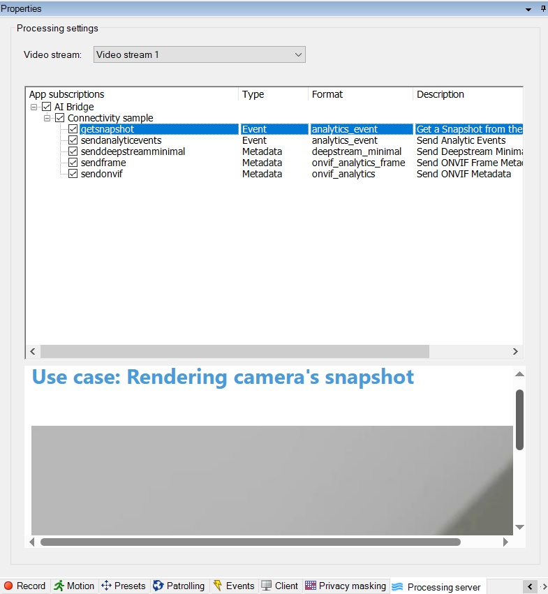

# Sample IVA App

## IVA App code structure

The sample app code design is based on the principles of the Domain-driven design (DDD). The application consists of three package layers:

- Application layer: : At this layer, the application exposes handlers as part of its API and services. The handlers provide a facade to the whole backend.
  - Handlers:
    - "/": Exposes a static welcome page for the application. See [Welcome HomePage](#welcome-homepage).
    - "/snapshot/": Shows the feature for capturing snapshots. See [Render snapshots from cameras connected to the XProtect VMS](#render-snapshots-from-cameras-connected-to-the-xprotect-vms).
    - "/event/": Shows the feature for sending events. See [Send analytic events to the XProtect VMS](#send-analytic-events-to-the-xprotect-vms).
    - "/deepstreamminimal/": Shows the feature for sending DeepStream minimal metadata. See [Send Deepstream Minimal metadata to the XProtect VMS](#send-deepstream-minimal-metadata-to-the-xprotect-vms)
    - "/onvifframe/": Shows the feature for sending ONVIF frame metadata. See [Send ONVIF Frame metadata to the XProtect VMS](#send-onvif-frame-metadata-to-the-xprotect-vms)
    - "/onvif/": Shows the feature for sending ONVIF metadata. See [Send ONVIF metadata to the XProtect VMS](#send-onvif-metadata-to-the-xprotect-vms)
    

  - Services: The app contains the following services:
    - FileReader: Use this service to read the files containing events or metadata sent to the VMS.
    - GraphQLService: This service exposes an interface for the Milestone AI Bridge Webservice GraphQL API. For more information, open `<AI Bridge External Hostname>:4000`
    - QueryStringService: This service is responsible for extracting certain values from the handler request url.
    - TokenService: Some of the resources exposed by Milestone AI Bridge require a token for authorization. Usually, the `XProtect Management Client`user forwards a token to the application. When `Milestone AI Bridge` requests the protected resource, the app is responsible for verifying and forwarding the token to `Milestone AI Bridge`.
    - TopicRestService: Starts or stops sending REST queries to the VMS. The REST queries contain, for example, analytic events or metadata.

- Domain layer:
  - Token classes:
    - TokenClaims: This class shows a list of IDP registered issuers.
    - TokenValidator: This class parses the token issuer and validates it against the TokenClaims.
  
  - Enums:
    - TopicType: An enum with the different types of topics, like event or metadata.

- Infrastructure layer:
  - GraphQL Repository: A client configured to send GraphQL `queries` and `mutations` based on the Milestone AI Bridge WebService GraphQL API scheme.
  - REST Repository: A client configured to send REST requests.

## IVA App Features

The Connectivity Sample IVA app contains the following features:

### Welcome HomePage

You can find this feature in the `Processing Server` node in `XProtect Management Client`.
This feature provides:

- An app descriptionp.
- (Optional) A configuration page for the app.

 

 

### Render snapshots from cameras connected to the XProtect VMS

You can find this feature on a camera's topic subscription.

You can, for example, define the location spots based on a live snapshot within the camera.

To view this functionality, go to the `Processing Server` in `XProtect Management Client`, select any camera, and then click on the `getsnapshot` topic. The IVA app renders a live snapshot.

 

 

### Send analytic events to the XProtect VMS

You can find this feature on a camera's topic subscription.

When a VMS user subscribes to this topic, the IVA app sends analytic events to the VMS. The VMS can then react to the received events, based on the alarm and event rules you define in the VMS.

To view this functionality, go to the `Processing Server` in `XProtect Management Client`, select any camera, and then click on the `sendanalyticevents` topic. A webpage will display a start/stop button that sends analytic events related to the selected camera.

 

 

### Send Deepstream Minimal metadata to the XProtect VMS

When a VMS user subscribes to this topic, the IVA app sends Deepstream Minimal metadata to the VMS. The Connectivity Sample shows the bounding boxes in `XProtect Smart Client`. If you enable the People category from the Metadata Search pane, you can search for this metadata category in the recorded camera feed.

To view this functionality, go to the `Processing Server` in `XProtect Management Client`, select any camera, and then click on the `senddeepstreamminimal` topic. A webpage will display a start/stop button to send ONVIF Frame Metadata related to the selected camera.

 

 

### Send ONVIF Frame metadata to the XProtect VMS

When a VMS user subscribes to this topic, the IVA app sends ONVIF Frame metadata to the VMS. The Connectivity Sample IVA shows the bounding boxes in `XProtect Smart Client`. If you enable the Location category from the Metadata Search pane, you can search for this metadata category in the recorded camera feed.

To view this functionality, go to the `Processing Server` in `XProtect Management Client`, select any camera, and then click on the `sendframe` topic. A webpage will display a start/stop button to send ONVIF Frame Metadata related to the selected camera.

 

 

### Send ONVIF metadata to the XProtect VMS

When a VMS user subscribes to this topic, the IVA app sends ONVIF metadata to the VMS. The Connectivity Sample IVA shows the bounding boxes in `XProtect Smart Client`. If you enable the Vehicles category from the Metadata Search pane, you can search for this metadata category in the recorded camera feed.

To view this functionality, go to the `Processing Server` in `XProtect Management Client`, select any camera, and then click on the `sendonvif` topic. A webpage will display a start/stop button to send ONVIF Metadata related to the selected camera.

 

 